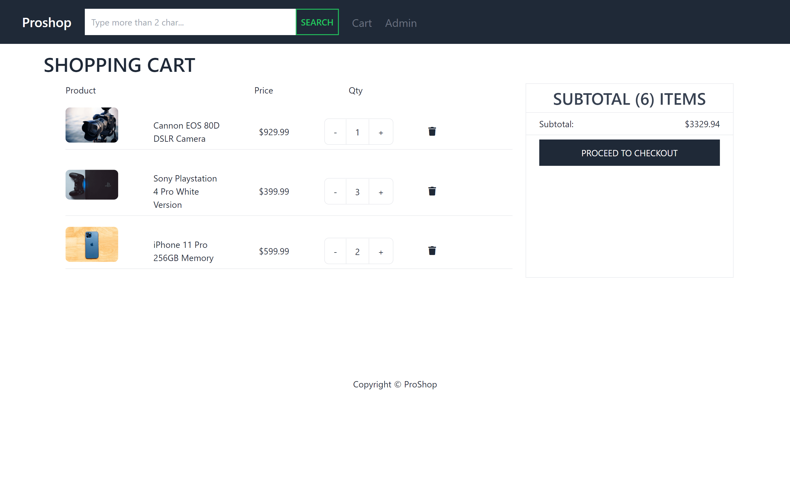

# ProShop eCommerce Platform (v2)

> eCommerce platform built with the Django and React stack & Redux.

- [Features](#features)
- [Usage](#usage)
  - [Env Variables](#env-variables)
  - [Install Dependencies (frontend & backend)](#install-dependencies-frontend--backend)
  - [Run](#run)
- [Photos](#photos)
  - [License](#license)

<!-- tocstop -->

## Features

- Full featured shopping cart
- Product reviews and ratings
- Top products carousel
- Product pagination
- Product search feature
- User profile with orders
- Admin product management
- Admin user management
- Admin Order details page
- Mark orders as delivered option
- Checkout process (shipping, payment method, etc)

### Install Dependencies (frontend & backend)

```
pip install -r requirements.txt
cd frontend
npm install
```

### Run

```

# Run frontend (:3000) & backend (:5000)
python manage.py runserver
```

## Build & Deploy

```
# Create frontend prod build
cd frontend
npm run build
```

---

## Photos





